

# Manual de Usuario / User Manual

### Sistema de Gestión de Cuadrantes Sanitarios / Healthcare Shift Management System

---

**Idiomas / Languages:**

- [Español](#español) 🇪🇸
- [English](#english) 🇬🇧

---

## 🇪🇸 GUÍA DE USUARIO (ESPAÑOL)

Bienvenido al sistema de gestión de cuadrantes. Esta plataforma ha sido diseñada para facilitar la organización de turnos y mejorar la comunicación entre los profesionales sanitarios y la dirección.

### 1. Acceso al Sistema

Para entrar en la aplicación, deberá introducir su **DNI (con letra) o NIE** y su **contraseña**.

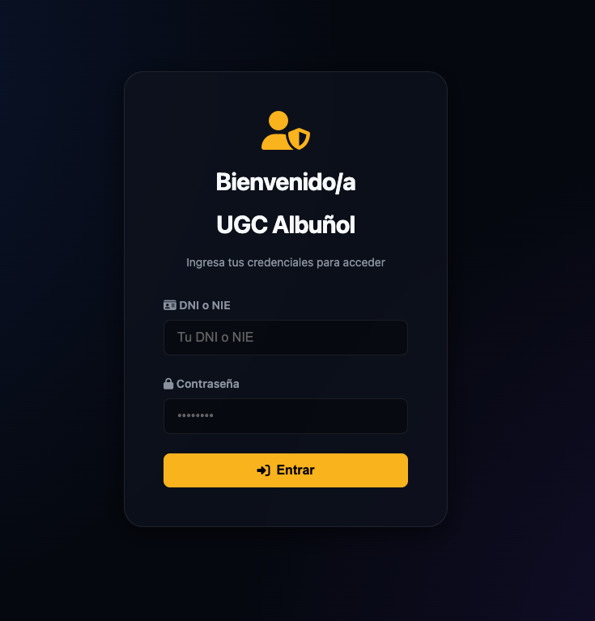

- Si es su primer acceso, consulte con el administrador su clave por defecto.
- Una vez dentro, podrá ver en la barra de navegación el contador de **usuarios online** que indica cuántos compañeros están conectados en ese momento.

---

#### 1.2 Reporte Diario (PDF)

Desde el panel principal, puede generar un PDF con la lista de profesionales que trabajan en el día actual, facilitando el control de presencia y la organización del centro.

#### 1.3 Cambio de contraseña

Desde el panel principal, se puede cambiar la contraseña.

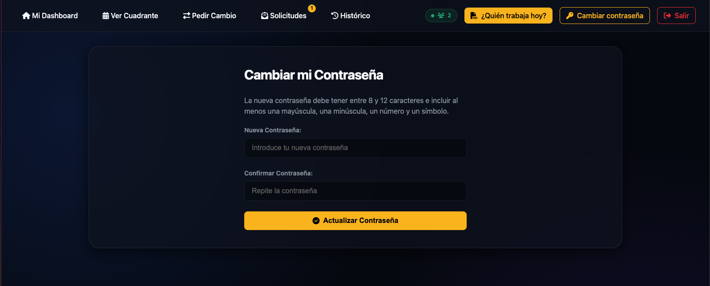

---

### 2. Guía para el Profesional

Si su rol es **Profesional**, dispondrá de las siguientes herramientas:

#### 2.1 Mi Dashboard

Es la pantalla de inicio. Te dará la bienvenida y te mostrará tu categoría y el centro al que estás asignado.

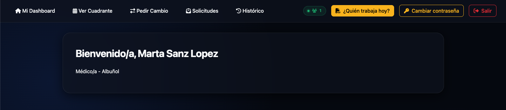

#### 2.2 Ver Mi Cuadrante

Acceda al calendario mensual completo.

- Los días con turno asignado aparecen resaltados.
- Al hacer clic en un turno, verá los detalles del centro de trabajo.
- **Descargar PDF**: Puede generar un documento oficial con su cuadrante mensual pulsando el botón de descarga en la parte superior derecha.

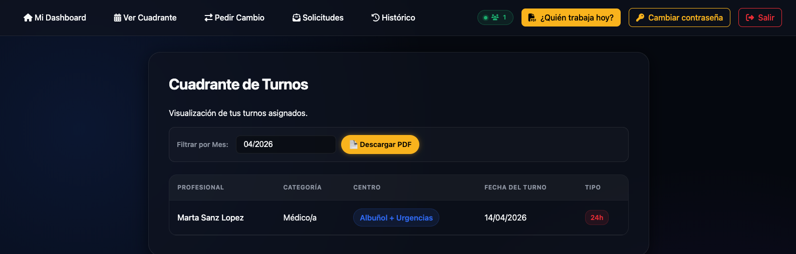

#### 2.3 Pedir Cambio de Turno

Si necesita intercambiar una guardia con un compañero:

1. Seleccione el **turno de su calendario** que desea cambiar.
2. Elija al **compañero** con el que quiere realizar el cambio (solo aparecerán profesionales de su misma categoría).
3. Seleccione el **turno del compañero** que usted pasará a realizar.
4. **Validación Automática**: El sistema comprobará si el cambio respeta los descansos legales de 24 horas. Si no es así, la aplicación le impedirá realizar la solicitud por seguridad.

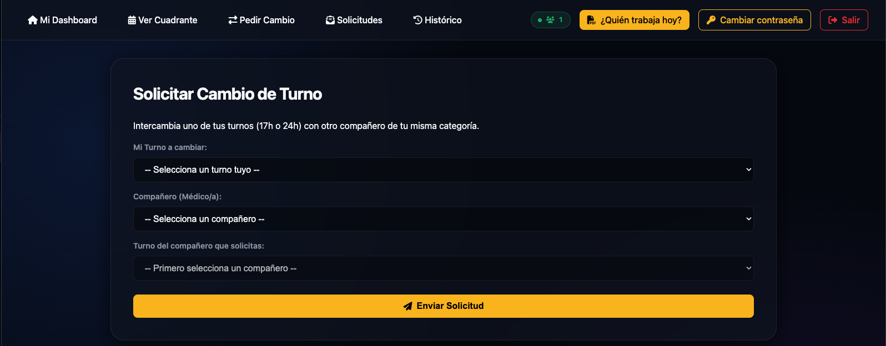

#### 2.4 Gestión de Solicitudes

En el apartado de **Solicitudes**, verá las peticiones que otros compañeros le han enviado. Puede:

- **Aceptar**: El cambio se hará efectivo automáticamente en el cuadrante de ambos.
- **Rechazar**: El cambio se anulará.

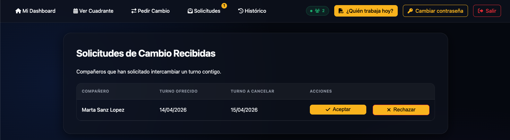

#### 2.5 Histórico

En el apartado de **Histórico**, podrá ver todos los intercambios realizados con otros compañeros.

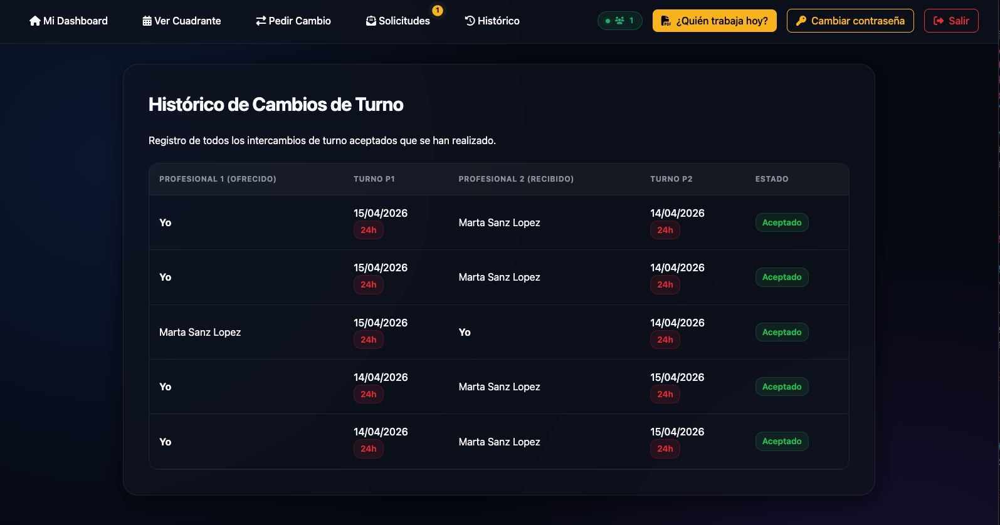

---

### 3. Guía para Dirección

Si su rol es **Dirección**, tendrá privilegios de supervisión y registro de usuarios:

#### 3.1 Registro de Usuarios

Se podrá dar de alta a nuevos usuarios.

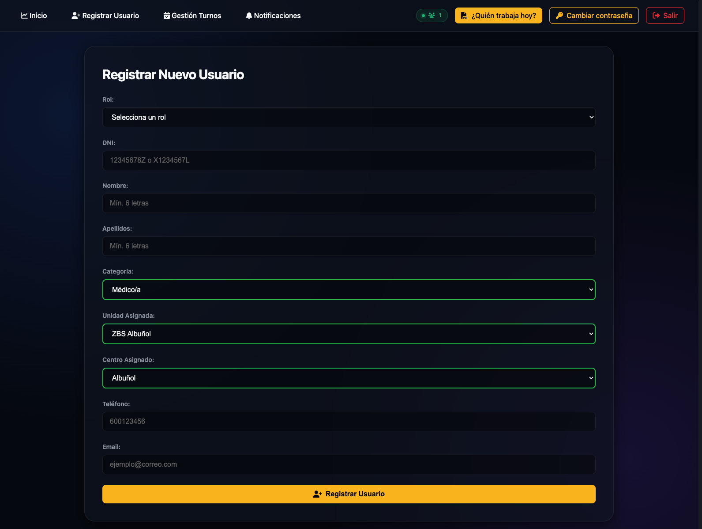

#### 3.2 Gestión de Turnos

Podrá visualizar el cuadrante de todos los profesionales y realizar asignaciones manuales para cubrir las necesidades del servicio. Al añadir o eliminar filas durante la asignación múltiple, el sistema actualizará dinámicamente en tiempo real la previsualización del cuadrante inferior para mostrar los turnos del profesional seleccionado, agilizando la planificación.

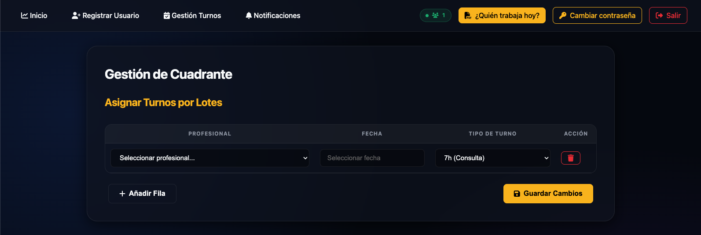

#### 3.3 Ver Turnos por Profesional

En la barra de navegación dispone de la opción **Ver Turnos**. Esta herramienta permite:

- Seleccionar un profesional específico de un listado.
- Filtrar sus turnos por un mes y año concretos.
- Descargar un reporte en PDF de su cuadrante mensual individual.

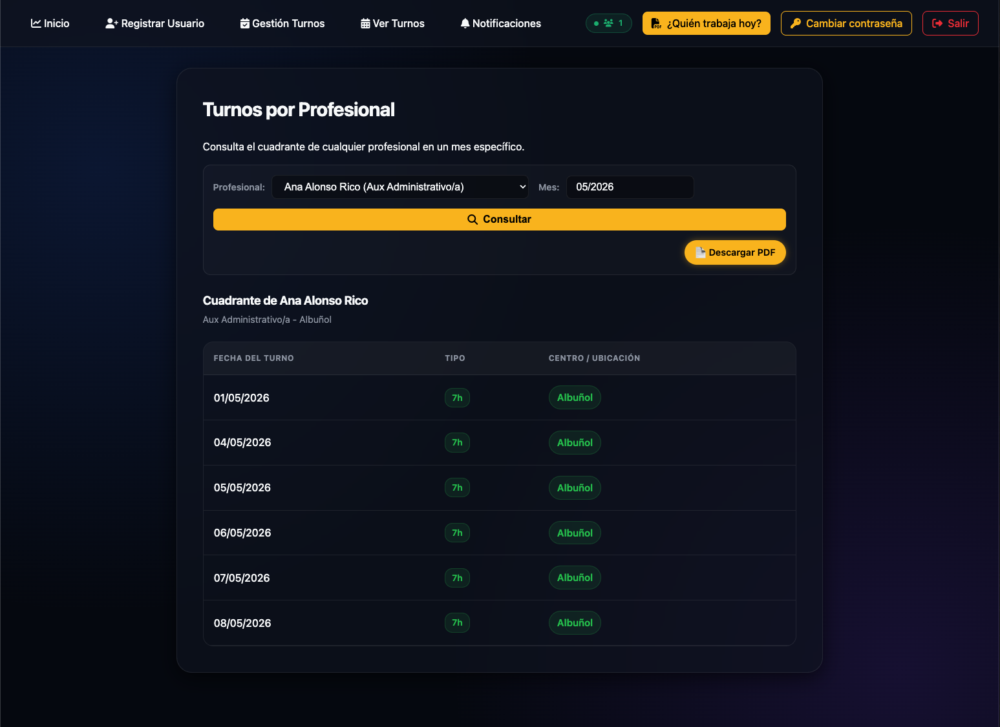

#### 3.4 Notificaciones de Cambios

En esta sección podrá ver todos los intercambios realizados entre profesionales.

- Los cambios **Nuevos** aparecerán resaltados en color ámbar para que esté al tanto de la actividad reciente.
- Dispone de un buscador por **Mes y Año** para consultar el histórico de cambios aceptados.

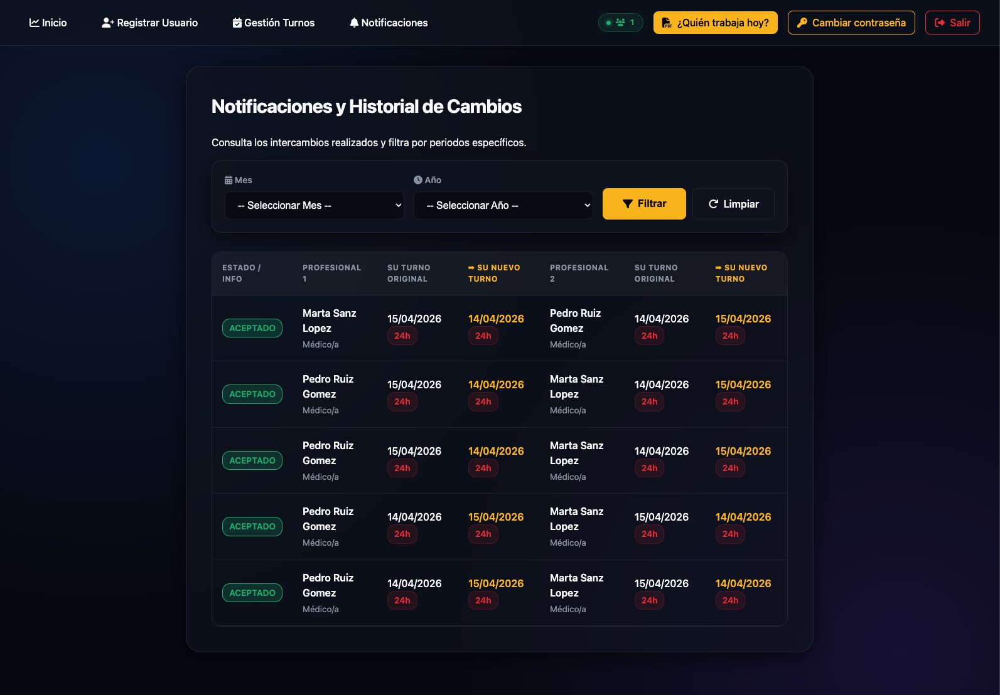

### 4. Guía para el Administrador

El Administrador es el encargado de mantener la base de datos de personal:

- **Alta de Usuario**: Introducir nuevos trabajadores asignando su categoría y unidad.
- **Edición y Borrado**: Modificar datos de contacto, cambiar roles o eliminar usuarios de forma segura utilizando un listado paginado para facilitar su búsqueda.

---

### 5. Opciones Comunes

- **Reporte Diario (PDF)**: Desde el panel principal, puede generar un PDF con la lista de profesionales que trabajan en el día actual, facilitando el control de presencia y la organización del centro.
- **Cambiar Contraseña**: Recomendamos cambiar su clave tras el primer acceso desde la opción "Cambiar Password" en el menú de usuario.
- **Modo Visual**: La aplicación detecta automáticamente la configuración de su dispositivo (Modo Claro/Oscuro) para mejorar la legibilidad.
- **Cierre de Sesión**: Utilice siempre el botón "Salir" al finalizar su jornada para proteger sus datos personales.

---

[Volver al inicio / Back to top](#top)

---

## 🇬🇧 USER GUIDE (ENGLISH)

Welcome to the shift management system. This platform has been designed to facilitate shift organization and improve communication between healthcare professionals and management.

### 1. System Access

To enter the application, you must enter your **DNI (with letter) or NIE** and your **password**.

- If this is your first access, consult the administrator for your default key.
- Once inside, you can see the **online users** counter in the navigation bar, which indicates how many colleagues are currently connected.

---

#### 1.2 Daily Report (PDF)

From the main panel, you can generate a PDF with the list of professionals working on the current day, facilitating presence control and center organization.

#### 1.3 Password Change

From the main panel, you can change your password.

---

### 2. Guide for the Professional

If your role is **Professional**, you will have the following tools:

#### 2.1 My Dashboard

This is the home screen. It will welcome you and show your category and the center you are assigned to.

#### 2.2 View My Schedule

Access the full monthly calendar.

- Days with an assigned shift are highlighted.
- By clicking on a shift, you will see the workplace details.
- **Download PDF**: You can generate an official document with your monthly schedule by pressing the download button at the top right.

#### 2.3 Requesting a Shift Swap

If you need to exchange an on-call shift with a colleague:

1. Select the **shift from your calendar** that you wish to change.
2. Choose the **colleague** you want to swap with (only professionals from your same category will appear).
3. Select the **colleague's shift** that you will take over.
4. **Automatic Validation**: The system will check if the swap respects the legal 24-hour rest periods. If not, the application will prevent the request for safety reasons.

#### 2.4 Managing Requests

In the **Requests** section, you will see invitations sent to you by other colleagues. You can:

- **Accept**: The swap will automatically take effect in both participants' schedules.
- **Reject**: The swap will be canceled.

#### 2.5 History

In the **History** section, you can see all swaps carried out with other colleagues.

---

### 3. Guide for Management

If your role is **Management**, you will have supervision and user registration privileges:

#### 3.1 User Registration

New users can be registered.

#### 3.2 Shift Management

You will be able to view the schedule of all professionals and make manual assignments to cover service needs. As a new feature, when adding or deleting rows during bulk assignments, the system will dynamically update the bottom schedule preview in real-time to show the selected professional's shifts, streamlining the planning process.

#### 3.3 View Shifts by Professional

In the navigation bar, you have the **View Shifts** option. This tool allows you to:

- Select a specific professional from a list.
- Filter their shifts by a specific month and year.
- Download a PDF report of their individual monthly schedule.

#### 3.4 Change Notifications

In this section, you can see all swaps carried out between professionals.

- **New** changes will appear highlighted in amber so you are aware of recent activity.
- A search engine by **Month and Year** is available to consult the history of accepted changes.

### 4. Guide for the Administrator

The Administrator is in charge of maintaining the personnel database:

- **User Registration**: Introduce new workers by assigning their category and unit.
- **Editing and Deletion**: Modify contact data, change roles, or securely delete users using a paginated list to facilitate searching.

---

### 5. Common Options

- **Daily Report (PDF)**: From the main panel, you can generate a PDF with the list of professionals working on the current day, facilitating presence control and center organization.
- **Change Password**: We recommend changing your key after the first access from the "Change Password" option in the user menu.
- **Visual Mode**: The application automatically detects your device's settings (Light/Dark Mode) to improve readability.
- **Logout**: Always use the "Exit" button at the end of your shift to protect your personal data.

---

[Back to top / Volver al inicio](#top)
